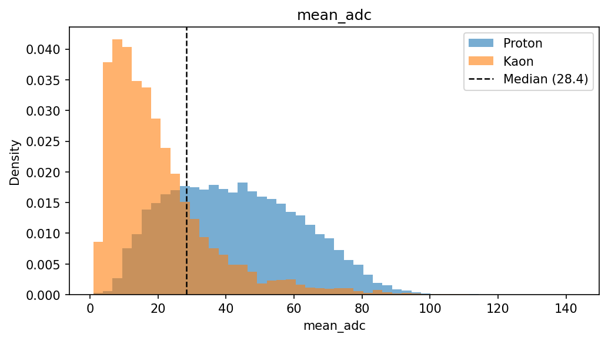
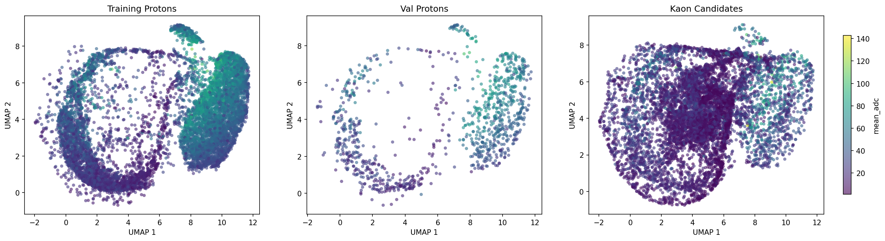
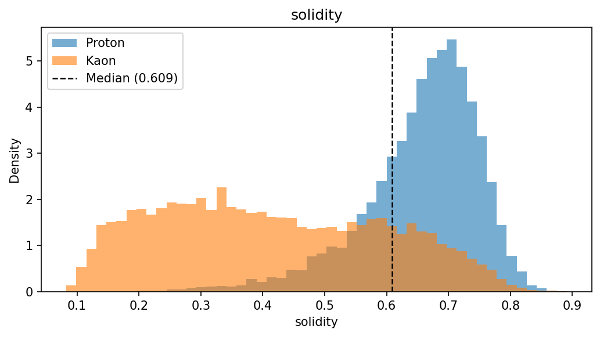
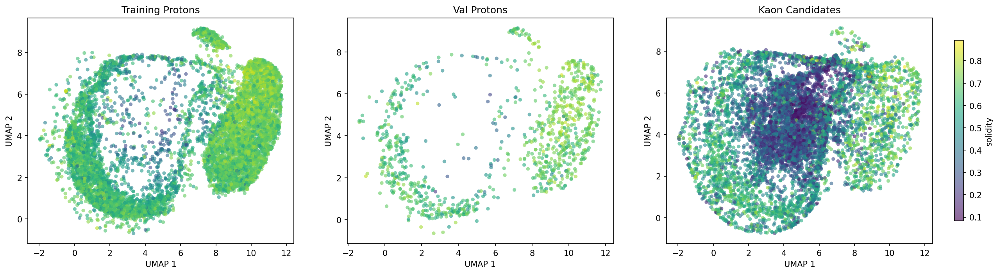
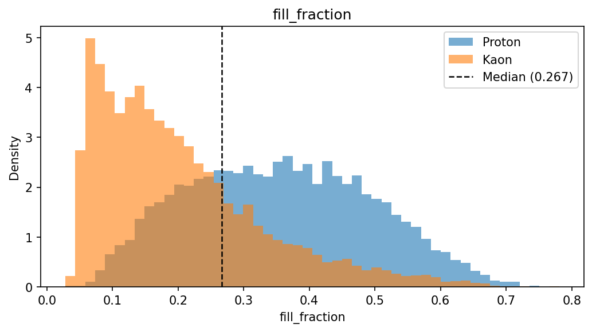
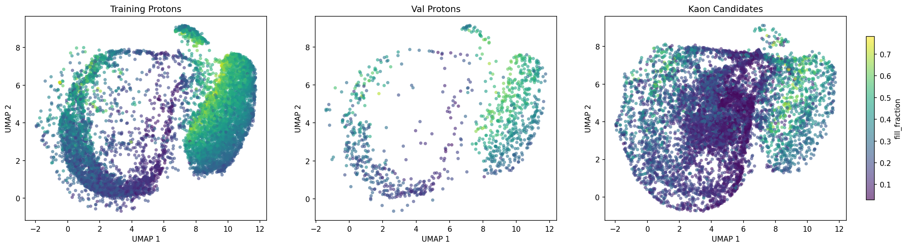
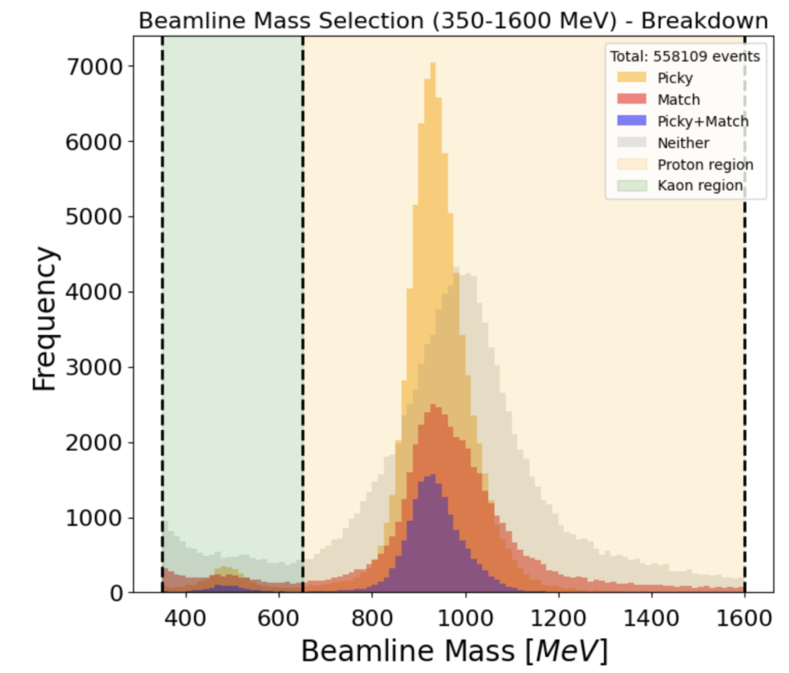
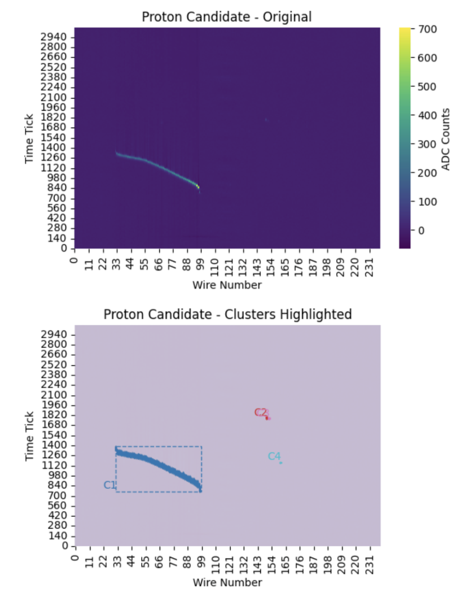
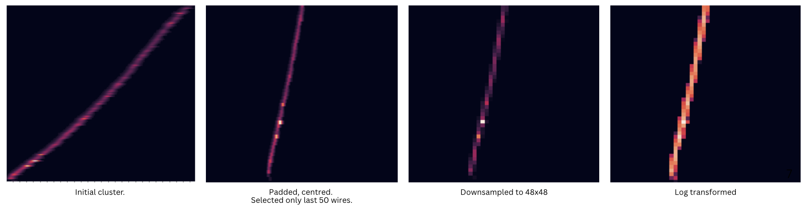
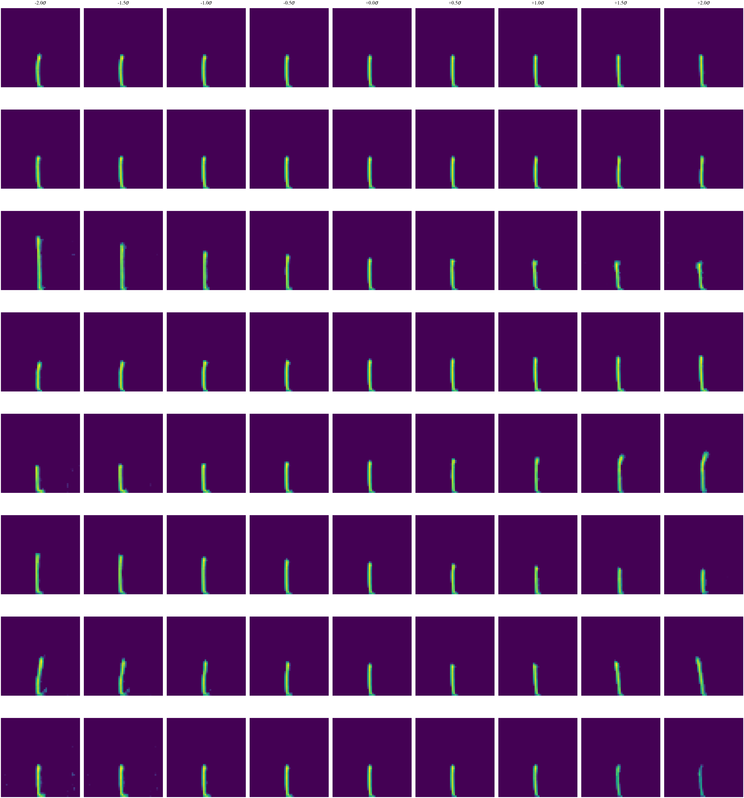

# Proton-Kaon VAE

Unsupervised representation learning for proton/kaon particle identification using a convolutional Variational Autoencoder (VAE) trained on Liquid Argon Time Projection Chamber (LArIAT) detector images.

## Overview

This project learns latent representations of proton and kaon interactions in a liquid argon detector. Rather than training a supervised classifier, a β-VAE is trained to reconstruct 2-channel calorimetry images (collection and induction wire planes). The learned latent space is then analysed against handcrafted physics features to understand what the model has internalised about the underlying physics.

**Scientific context:** Protons and kaons leave distinct ionisation signatures in liquid argon: most notably, the Bragg peak profile near the end of a track. The dE/dx vs. residual range curve (Bethe-Bloch) differs between particle species. Kaons can decay into secondary particles which helps identification as well. This project asks whether a generative model, trained without particle labels, naturally organises its latent space around physically meaningful quantities. 

## Pipeline

```
ROOT files (protons, kaons)
    ↓  [scripts/dataset.py]
Cluster extraction → plane matching → Bethe-Bloch chi-squared scoring
    ↓  [scripts/image_making.py]
GPU image preprocessing → 48×48 2-channel log1p tensors
    ↓  [scripts/run_training.py]
β-VAE training (configurable architecture, sweep support)
    ↓  [scripts/run_inference.py]
Latent vectors + reconstructions for train / val / kaon sets
    ↓  [scripts/compute_features.py]
22 handcrafted physics features per event (4-6 most relevant chosen for clarity)
    ↓  [scripts/analyse_latents.py]
N-mode latent analysis: correlation, traversal, logistic probe, non-linear
```

## Project Structure

```
src/
├── event.py            # Event loading and cluster extraction from detector data
├── images.py           # Image padding, downsampling, GPU batch utilities
├── open_root.py        # ROOT file → pandas DataFrame loader
├── bethe_bloch.py      # Load expected dE/dx vs. residual-range curves
├── chi2.py             # Chi-squared scoring against Bethe-Bloch hypotheses
├── clustering.py       # Bulk cluster extraction across events and particle types
├── cuts.py             # Cluster and image quality filters
├── matching.py         # Greedy 1-to-1 cluster pairing across wire planes
├── features/
│   ├── calorimetry.py  # Energy deposition and Bragg peak features
│   ├── topology.py     # Geometric and morphological features
│   └── plot.py         # Feature histogram and UMAP plotting
├── models/
│   └── configVAE.py    # Convolutional VAE (configurable depth, activation, latent dim)
├── losses/
│   └── vae.py          # Weighted MSE reconstruction + KL divergence loss
├── train/
│   ├── train.py        # Training loop
│   ├── logger.py       # Save training logs and metadata to JSON
│   └── plot.py         # Training curve visualization
└── inference/
    └── inference.py    # Batched encoder inference → latent vectors + reconstructions

scripts/
├── dataset.py          # End-to-end data pipeline: ROOT → matched cluster DataFrames
├── image_making.py     # GPU preprocessing pipeline → PyTorch tensor dataset
├── run_training.py     # Train a VAE from a YAML config with CLI overrides
├── run_inference.py    # Run inference and save latents / reconstructions
├── run_sweep.py        # Remote hyperparameter sweep (SSH + rsync, multi-GPU)
├── compute_features.py # Extract 22 physics features + chi-squared + log-likelihood
└── analyse_latents.py  # 4 latent-space analysis modes (correlation, traversal, probes)

configs/
├── default.yaml        # Base configuration (data, model, optimizer, training, output)
└── sweep.yaml          # Hyperparameter grid for sweep runs

notebooks/              # Exploratory notebooks mirroring the script analyses
```

## Model Architecture

**Convolutional β-VAE**

- **Input:** (2, 48, 48) images — collection plane (charge) and induction plane (induced signal), log1p-transformed
- **Encoder:** Stacked Conv2d → BatchNorm → Activation → Dropout blocks, followed by FC layers to μ and log σ²
- **Latent space:** Configurable dimensionality (typically 2–128)
- **Decoder:** Symmetric transposed convolution stack reconstructing both planes
- **Loss:** Weighted MSE (signal pixels up-weighted) + β · KL divergence

**Configurable hyperparameters:**

| Parameter | Options |
|-----------|---------|
| `latent` | integer (e.g. 2, 4, 8, 16, 32, 64, 128) |
| `channels` | list of channel widths per encoder block |
| `activation` | `softplus`, `relu`, `gelu`, `silu`, `leaky_relu` |
| `beta` | KL weight (e.g. 0.5, 1.0, 5.0, 10.0) |
| `kernel` | convolution kernel size |
| `dropout` | encoder dropout rate |

## Data Pipeline

### 1. Cluster Extraction (`scripts/dataset.py`)

Raw detector ADC data is read from ROOT files. Events are separated into collection and induction wire planes (240 wires each). Connected-region clustering identifies particle tracks above a noise threshold. Several clustering algorithms are available:

- Connected components (flood fill)
- Max-ADC-ratio seeding
- Longest cluster selection
- BFS search from peak ADC

Clusters are quality-filtered (spatial region, height, width) then greedily matched 1-to-1 across planes using a distance-weighted score (row offset, column offset, height difference).

Matched clusters are merged with beamline metadata (momentum, mass) and reconstruction outputs (residual range, dE/dx per hit). Chi-squared scores are computed against Bethe-Bloch curves for proton and kaon hypotheses, producing a `particle_hypothesis` label (0 = kaon, 1 = proton) per track.

### 2. Image Preprocessing (`scripts/image_making.py`)

GPU-accelerated pipeline:
1. Pad cluster images to a common canvas centered on zero
2. Cut to a fixed number of wire rows
3. Bilinear downsample to 48×48
4. Stack collection + induction → 2-channel format
5. Apply log1p to compress the ADC dynamic range
6. Save as a PyTorch tensor with separate proton and kaon keys

### 3. Feature Engineering (`scripts/compute_features.py`)

22 handcrafted physics features per cluster, across two categories:

**Calorimetry (energy deposition):**
- Total, mean, median, max, std ADC; ADC entropy
- Bragg peak height, position, ratio-to-track, ratio-to-median, width
- Bragg rise slope; end-vs-start ADC ratio; quartile means; peak integral fraction
- Profile coefficient of variation; monotonic rise fraction; relative peak energy

**Topology (geometry):**
- Number of signal pixels; profile skewness and kurtosis
- Number of local maxima (kink/decay signature)
- Solidity (convex hull fill ratio); bounding-box fill fraction

Representative plots for the most discriminating features are shown below. Bragg peak position and mean ADC are the clearest calorimetry summaries, while solidity and fill fraction capture the topology differences introduced by kaon secondaries and kinks.

| Feature | Distribution | UMAP |
|---|---|---|
| Max ADC position |  |  |
| Mean ADC |  |  |
| Solidity |  |  |
| Fill fraction |  |  |

The tracker and clustering stages that feed these features are illustrated here.

| Beamline | Clustering | Images |
|---|---|---|
|  |  |  |

## Configuration

Training is driven by YAML configs with CLI overrides:

```yaml
data:
  val_split: 0.1
  random_seed: 42

model:
  type: vae
  latent: 16
  channels: [32, 64, 128]
  kernel: 5
  activation: softplus
  stride: 2
  padding: 2
  dropout: 0

optimizer:
  lr: 0.001
  weight_decay: 0.0001

train:
  epochs: 200
  batch_size: 32
  beta: 1.0
```

Run training with a config and optional overrides:

```bash
python scripts/run_training.py --config configs/default.yaml --latent 32 --beta 5.0
```

Run inference on a trained model:

```bash
python scripts/run_inference.py --config configs/default.yaml
```

## Hyperparameter Sweeps

`scripts/run_sweep.py` runs Cartesian grid searches over configurable hyperparameter axes (latent dims, channel configs, beta, activation). It distributes jobs over remote GPU nodes via SSH and rsync, allocates GPUs concurrently, validates completed models, and syncs results locally.

Sweep parameters are defined in `configs/sweep.yaml`.

## Latent Analysis

`scripts/analyse_latents.py` supports four analysis modes, each saving figures under a per-model output directory:

### 1. Correlation (`--mode correlation`)
Spearman correlation heatmap between each latent dimension and each handcrafted feature. Variance decomposition shows the linear R² contributed by individual latent dimensions per feature category.

Output: `disentanglement_heatmap.png`, `variance_decomposition.png`

### 2. Latent Traversal (`--mode traversal`)
Sweeps each latent dimension ±2σ while holding others fixed, decoding the result. Produces a 2D grid of reconstructed images — one row per latent dimension — for visual inspection of what each dimension encodes.

Output: `latent_traversal.png`



### 3. Logistic Regression Probe (`--mode logistic`)
Trains a logistic regression on latent subsets to measure linear separability of proton vs. kaon. Reports AUC-ROC and event-level classification agreement.

Output: `linear_probe.png`

### 4. Non-linear Analysis (`--mode nonlinear`)
Compares Ridge regression vs. MLP (2×16 hidden units) R² for predicting each physics feature from the latent space. The gap between linear and non-linear performance reveals non-linearly encoded information. Also computes permutation importance and mutual information per latent dimension per feature.

Output: `nonlinear_r2.png`, `permutation_importance_{category}.png`, `mutual_information_{category}.png`

## Outputs

| Artifact | Description |
|----------|-------------|
| `model_*.pt` | Saved VAE weights |
| `logs/*.json` | Training history (loss curves, config, dataset info, timestamp) |
| `curves_*.png` | Train/val loss plots (total, reconstruction, KL) |
| `{train,val,kaon}.npz` | Latent vectors, reconstructions, per-sample reconstruction error |
| `features.pkl` | 22-feature DataFrame per event |
| `figs/` | All analysis visualizations |

## Dependencies

```
torch
numpy
pandas
scikit-learn
scikit-image
scipy
matplotlib
seaborn
umap-learn
awkward
uproot
pyyaml
tqdm
```

Python 3.11+. GPU training supported on CUDA (NVIDIA) and MPS (Apple Silicon); falls back to CPU automatically.

## Physics Background

**LArIAT** is a liquid argon time projection chamber test-beam experiment. Charged particles traversing the detector ionize the argon; the resulting electrons drift to wire planes that record a 2D projection of the track as a function of wire number (space) and drift time.

Particles lose energy at a rate described by the **Bethe-Bloch formula**, which depends on particle mass and momentum. Near the end of a track, the energy loss peaks sharply, the **Bragg peak**, and its shape is characteristic of the particle species. Protons are significantly heavier than kaons, producing a more pronounced and displaced Bragg peak at comparable momenta.

The **chi-squared score** quantifies how well a track's measured dE/dx profile matches the expected Bethe-Bloch curve for each particle hypothesis, providing a traditional physics-based PID baseline. The VAE approach asks whether this information, and potentially more (decay, etc.), is encoded in the raw image without explicit physics labels.
