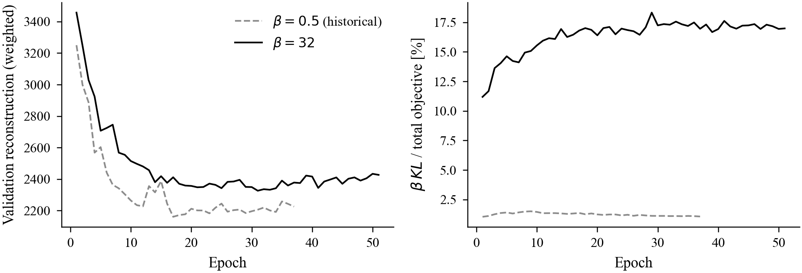
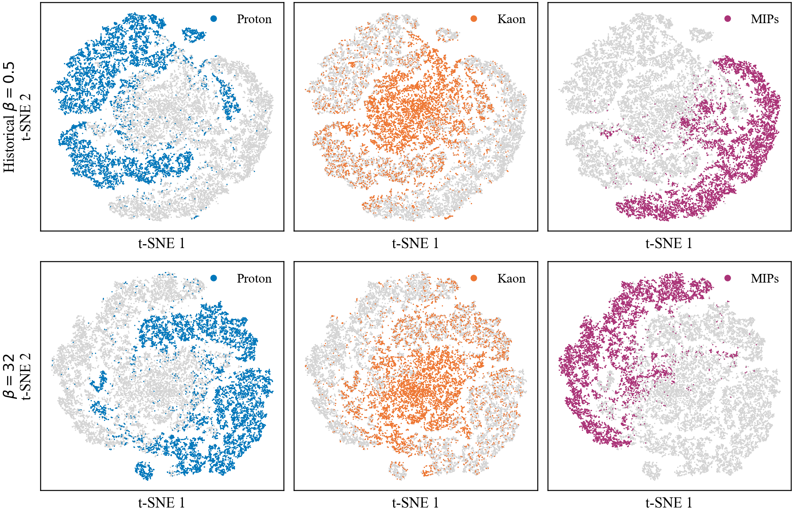
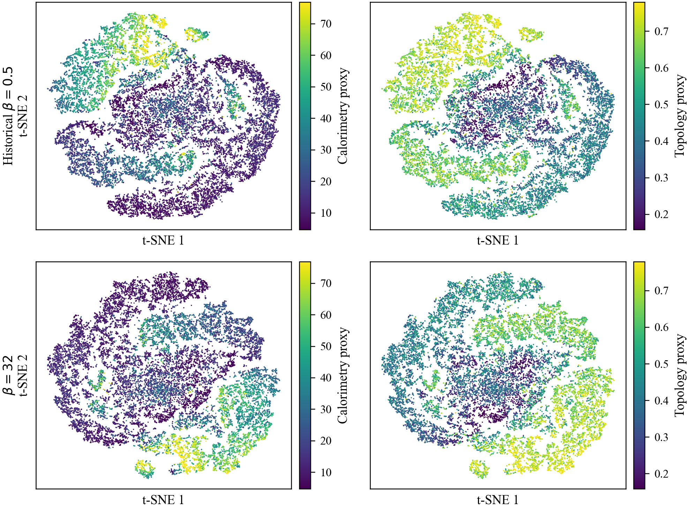
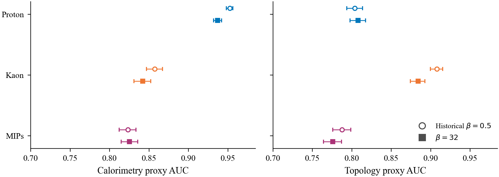
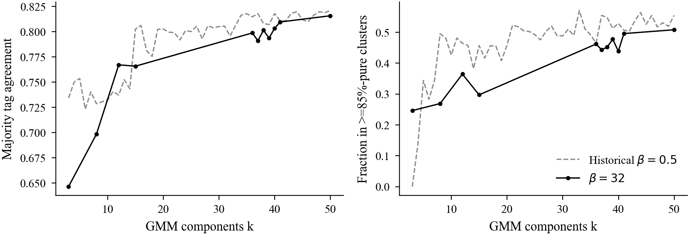
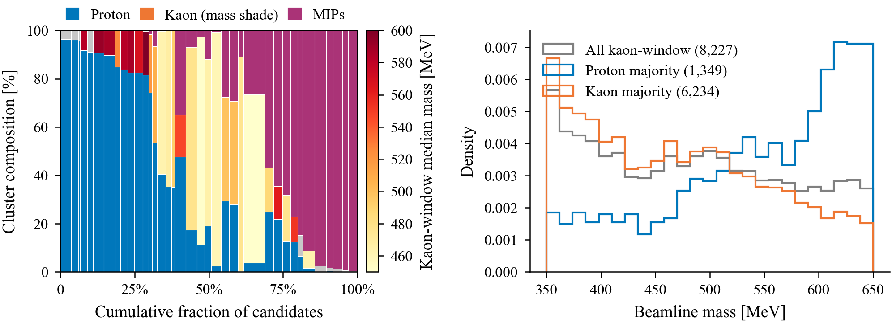
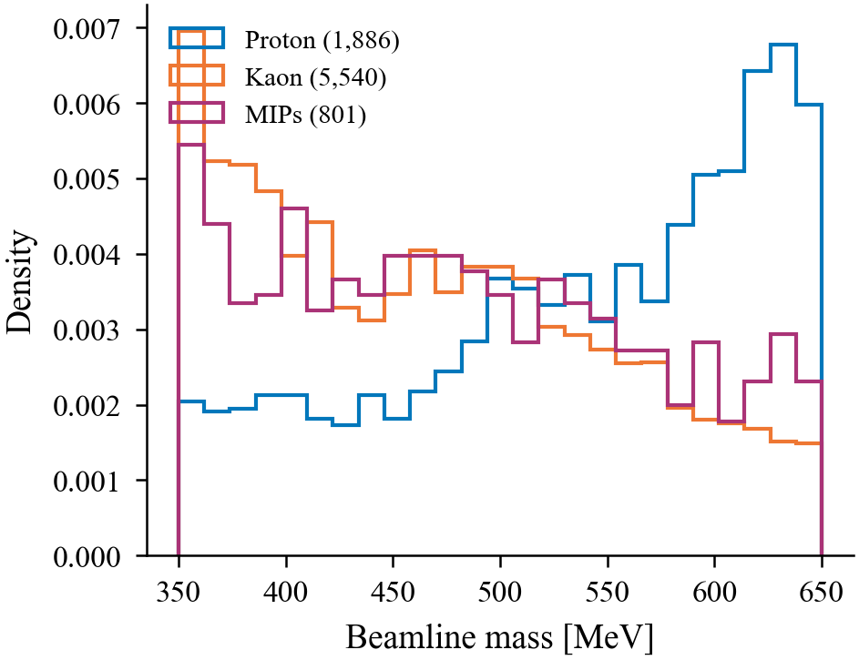
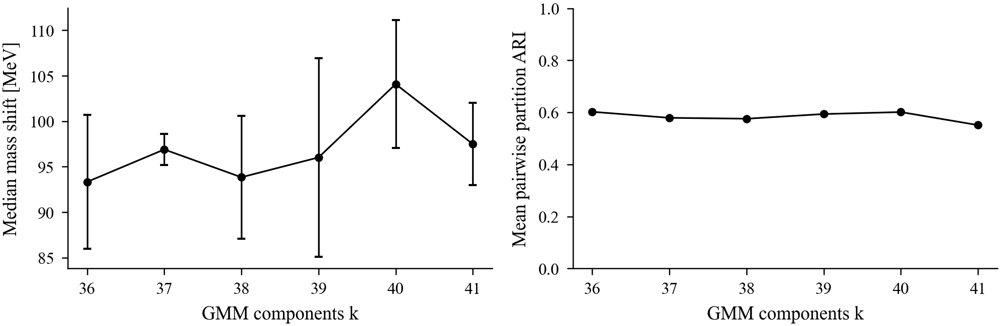

# Figure captions

## training_objective

Historical and beta=32 primary training histories. Left: sampled validation reconstruction. Right: beta-weighted KL share. Checkpoint rules are identical; seed and hardware differ in this historical comparison.

## species_tsne

Separate raw-latent t-SNE projections for historical beta=0.5 (top) and beta=32 seed zero (bottom), with proton, kaon-window and MIP tags highlighted in matching columns. Grey points are the other tags. Neither projection enters any clustering fit. Positions and orientations cannot be compared between models.

## proxy_tsne

The same t-SNE coordinates within each model, coloured by mean ADC (left) and solidity (right). Historical beta=0.5 is above beta=32. Colour limits use the shared observed population; the projection is descriptive.

## proxy_auc

Within-tag, validation-only median-split logistic probes. Open circles: historical beta=0.5; filled squares: beta=32 seed zero. Bars are percentile intervals from 2,000 resamples of frozen out-of-fold predictions, and omit VAE training uncertainty.

## cluster_count

Original full-covariance GMM scan on raw posterior means. Left: majority tag agreement; right: fraction of all candidates in clusters at least 85% pure against the tags used to name them. Solid black: beta=32; dashed grey: historical beta=0.5. Fine clusters are descriptive rather than unique physical populations.

## composition_and_mass

Primary beta=32 k=37 GMM. Left: cluster composition, widths proportional to population; kaon segments shaded by within-cluster median beamline mass where at least 50 kaon candidates are present. Right: mass in the kaon window split by majority-tag assignment. Mass does not enter training or GMM fitting. The tag itself is defined by this mass window.

## anchored_mass

Kaon-window mass split by the tag-anchored comparison at beta=32. These densities use proton and MIP tags during fitting and are a supporting comparison, not fully unsupervised separation.

## gmm_stability

Beta=32 k=36-41, five GMM initialization seeds. Left: mean proton-minus-kaon group mass shift with one seed standard deviation. Right: mean pairwise partition ARI. Error bars show initialization variability, not event-bootstrap confidence intervals.

